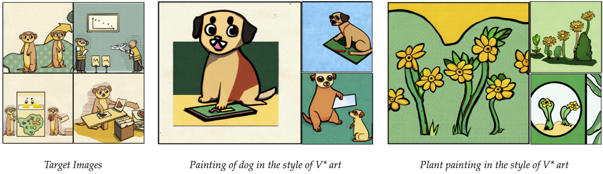
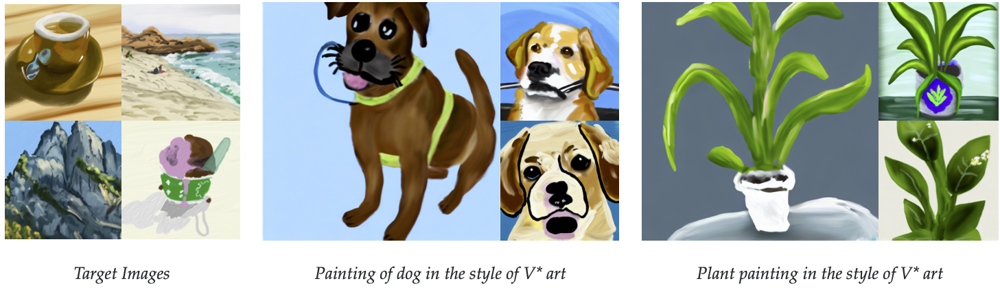

# Custom Diffusion

### [website](https://www.cs.cmu.edu/~custom-diffusion/)  |  [code](https://github.com/adobe-research/custom-diffusion)  | [paper](http://arxiv.org/abs/2212.04488)


<br>
<div class="gif">
<p align="center">

</p>
</div>

[Custom Diffusion](https://www.cs.cmu.edu/~custom-diffusion) is a method to fine-tune large-scale text-to-image diffusion models e.g. [Stable Diffusion](https://github.com/CompVis/stable-diffusion) given few (~4-20) user-provided images of a new concept. Our method is computationally efficient (~6 minutes on 2 A100 GPUs) as it fine-tunes only a subset of model parameters, namely key and value projection matrices in the cross-attention layers of the diffusion model. This also results in low memory requirements for storing each additional concept model (75MB) apart from the pretrained model.

***Multi-Concept Customization of Text-to-Image Diffusion*** <br>
[Nupur Kumari](https://nupurkmr9.github.io/), Bingliang Zhang, [Richard Zhang](https://richzhang.github.io/), [Eli Shechtman](https://research.adobe.com/person/eli-shechtman/), [Jun-Yan Zhu](https://www.cs.cmu.edu/~junyanz/)<br>

## Getting Started

Our code builds on [Stable Diffusion](https://github.com/CompVis/stable-diffusion). 


```
git clone git@github.com:adobe-research/custom-diffusion.git
cd custom-diffusion
git clone https://github.com/CompVis/stable-diffusion.git
cd stable-diffusion
conda env create -f environment.yaml
conda activate ldm

```

For downloading the model checkpoint, please refer [here](https://huggingface.co/CompVis/stable-diffusion-v1-4).

### Single-Concept Fine-tuning

**Real images as regularization**


**Generated images as regularization**


### Multi-Concept Fine-tuning

**Joint Training**


**Optimization**


### Fine-tuning on human faces


## Results

All our results are based on fine-tuning [stable-diffusion-v1-4](https://huggingface.co/CompVis/stable-diffusion-v-1-4-original) model.
We show results on various category of images including scene, pet, personal toy, and style, and with varying number of training samples. 
For more generations and comparison with concurrent methods please refer to our [webpage](https://www.cs.cmu.edu/~custom-diffusion/) and [gallery](https://www.cs.cmu.edu/~custom-diffusion/results.html).


### Single-Concept Results

<div>
<p align="center">

</p>
<p align="center">

</p>
<p align="center">

</p>
<p align="center">

</p>
<p align="center">

</p>
<p align="center">

</p>
<p align="center">

</p>
<p align="center">

</p>
</div>


### Multi-Concept Results


<div>
<p align="center">

</p>
<p align="center">

</p>
<p align="center">

</p>
<p align="center">

</p>
</div>


## Method Details


<div>
<p align="center">

</p>
</div>


Given the few user-provided images of a concept, our method augments a pre-trained text-to-image diffusion model, enabling new generations of the concept in unseen contexts. 
We fine-tune a small subset of model weights, namely the key and value mapping from text to latent features in the cross-attention layers of the diffusion model. 
Our method also uses a small set of regularization images (200) to prevent overfitting. For personal categories we add a new modifier token V* in front of the category name e.g., V* dog.
For multiple-concepts we jointly train on the dataset for the two concepts. Our method also enables post-hoc merging of two fine-tuned models using optimization. 
For more details please refer to our paper.  


## References

```
@article{kumari2022customdiffusion,
  title={Multi-Concept Customization of Text-to-Image Diffusion},
  author={Kumari, Nupur and Zhang, Bingliang and Zhang, Richard and Shechtman, Eli and Zhu, Jun-Yan},
  journal = {arXiv},
  year = {2022}
}
```

## Acknowledgments
We are grateful to Nick Kolkin, David Bau, Sheng-Yu Wang, Gaurav Parmar, John Nack, and Sylvain Paris for their helpful comments and discussion, and to Allie Chang, Chen Wu, Sumith Kulal, Minguk Kang, and Taesung Park for proofreading the draft. We also thank Mia Tang and Aaron Hertzmann for sharing their artwork. This work was partly done by Nupur Kumari during the Adobe internship. The work is partly supported by Adobe Inc. 
