# Custom Diffusion

### [website](https://www.cs.cmu.edu/~custom-diffusion/)  |  [code](https://github.com/adobe-research/custom-diffusion)  | [paper](http://arxiv.org/abs/2212.04488)


<br>
<div class="gif">
<p align="center">

</p>
</div>

[Custom Diffusion](https://www.cs.cmu.edu/~custom-diffusion) is a method to fine-tune large-scale text-to-image diffusion models e.g. [Stable Diffusion](https://github.com/CompVis/stable-diffusion) given few (~4-20) user-provided images of a new concept. Our method is computationally efficient (~6 minutes on 2 A100 GPUs) as it fine-tunes only a subset of model parameters, namely key and value projection matrices in the cross-attention layers of the diffusion model. This also results in low memory requirements for storing each additional concept model (75MB) apart from the pretrained model.

***Multi-Concept Customization of Text-to-Image Diffusion*** <br>
[Nupur Kumari](https://nupurkmr9.github.io/), [Bingliang Zhang](https://zhangbingliang2019.github.io), [Richard Zhang](https://richzhang.github.io/), [Eli Shechtman](https://research.adobe.com/person/eli-shechtman/), [Jun-Yan Zhu](https://www.cs.cmu.edu/~junyanz/)<br>

## Getting Started

```
git clone git@github.com:adobe-research/custom-diffusion.git
cd custom-diffusion
git clone https://github.com/CompVis/stable-diffusion.git
cd stable-diffusion
conda env create -f environment.yaml
conda activate ldm
pip install clip-retrieval
```

Our code was developed on the following commit `#21f890f9da3cfbeaba8e2ac3c425ee9e998d5229` of [stable-diffusion](https://github.com/CompVis/stable-diffusion).

For downloading the stable-diffusion model checkpoint, please refer [here](https://huggingface.co/CompVis/stable-diffusion-v1-4).

**Dataset:** we release some of the datasets used in paper [here](https://www.cs.cmu.edu/~custom-diffusion/assets/data.zip). 
Images taken from UnSpalsh are under [UnSplash LICENSE](https://unsplash.com/license). Moongate dataset can be downloaded from [here](https://github.com/odegeasslbc/FastGAN-pytorch). 

**Models:** all our models can be downloaded from [here](https://www.cs.cmu.edu/~custom-diffusion/assets/models/). 

### Single-Concept Fine-tuning

**Real images as regularization**
```
## downloadd dataset
wget https://www.cs.cmu.edu/~custom-diffusion/assets/data.zip
unzip data.zip

## run training (30 GB on 2 GPUs)
bash scripts/finetune_real.sh "cat" data/cat real_reg/samples_cat  cat finetune_addtoken.yaml <pretrained-model-path>

## save updated model weights
python src/get_deltas.py --path logs/<folder-name> --newtoken 1

## sample
python sample.py --prompt "<new1> cat playing with a ball" --delta_ckpt logs/<folder-name>/checkpoints/delta_epoch\=000004.ckpt --ckpt <pretrained-model-path>
```

Our results in the paper are not based on the [clip-retrieval](https://github.com/rom1504/clip-retrieval) for retrieving real images as the regularization samples. But this also leads to similar results.

**Generated images as regularization**
```
bash scripts/finetune_gen.sh "cat" data/cat gen_reg/samples_cat  cat finetune_addtoken.yaml <pretrained-model-path>
```


### Multi-Concept Fine-tuning

**Joint Training**

```
## run training (30 GB on 2 GPUs)
bash scripts/finetune_joint.sh "wooden pot" data/wooden_pot real_reg/samples_wooden_pot \
                                    "cat" data/cat real_reg/samples_cat  \
                                    wooden_pot+cat finetune_joint.yaml <pretrained-model-path>

## save updated model weights
python src/get_deltas.py --path logs/<folder-name> --newtoken 2

## sample
python sample.py --prompt "the <new2> cat sculpture in the style of a <new1> wooden pot" --delta_ckpt logs/<folder-name>/checkpoints/delta_epoch\=000004.ckpt --ckpt <pretrained-model-path>
```

**Optimization based weights merging**

```
python src/composenW.py --paths <delta_ckpt1>+<delta_ckpt2> --categories  "wooden pot+cat"  --ckpt <pretrained-model-path> 

## sample
python sample.py --prompt "the <new2> cat sculpture in the style of a <new1> wooden pot" --delta_ckpt optimized_logs/<folder-name>/checkpoints/delta_epoch\=000000.ckpt --ckpt <pretrained-model-path>
```


### Training on single-concept using Diffusers library

```
## install requirements 
pip install accelerate
pip install modelcards
pip install transformers>=4.25.1
pip install deepspeed
accelerate config
export MODEL_NAME="CompVis/stable-diffusion-v1-4"

## launch training script (2 GPUs recommended)

CUDA_VISIBLE_DEVICES=4,5 accelerate launch src/diffuser_training.py \
          --pretrained_model_name_or_path=$MODEL_NAME  \
          --instance_data_dir=./data/cat  \
          --class_data_dir=./real_reg/samples_cat/ \
          --output_dir=./logs/cat  \
          --with_prior_preservation --real_prior --prior_loss_weight=1.0 \
          --instance_prompt="photo of a <new1> cat"  \
          --class_prompt="cat" \
          --resolution=512  \
          --train_batch_size=2  \
          --gradient_accumulation_steps=1  \
          --learning_rate=1e-5  \
          --lr_scheduler="constant" \
          --lr_warmup_steps=0 \
          --max_train_steps=250 \
          --num_class_images=200 \
          --scale_lr \
          --modifier_token "<new1>"

## sample 
python src/sample_diffuser.py --delta_ckpt logs/cat/delta.bin --ckpt "CompVis/stable-diffusion-v1-4" --prompt "<new1> cat playing with a ball"
```
The above code is modified from the following [DreamBooth]( https://github.com/huggingface/diffusers/blob/main/examples/dreambooth/train_dreambooth.py) training script. For more details on how to setup accelarate please refere [here](https://github.com/huggingface/diffusers/blob/main/examples/dreambooth).

### Fine-tuning on human faces

For fine-tuning on human faces, we recommend `learning_rate=5e-6` and `max_train_steps=750` in the above diffuser training script or using `finetune_face.yaml` config in stable-diffusion training script. 

We obeserve better results with lower learning rate and longer training. With less images, fine-tuning all parameters in the cross-attention is slightly better which can be enabled with `--freeze_model "crossattn"`.  
Example results on fine-tuning with 14 close-up photos of [Richard Zhang](https://richzhang.github.io/) with the diffusers training script. 

<div>
<p align="center">
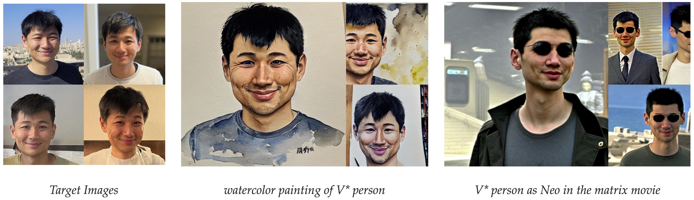
</p>
</div>

### Model compression

```
python src/compress.py --delta_ckpt <finetuned-delta-path> --ckpt <pretrained-model-path>

## sample
python sample.py --prompt "<new1> cat playing with a ball" --delta_ckpt logs/<folder-name>/checkpoints/compressed_delta_epoch\=000004.ckpt --ckpt <pretrained-model-path> --compress
```


## Results

All our results are based on fine-tuning [stable-diffusion-v1-4](https://huggingface.co/CompVis/stable-diffusion-v-1-4-original) model.
We show results on various category of images including scene, pet, personal toy, and style, and with varying number of training samples. 
For more generations and comparison with concurrent methods please refer to our [webpage](https://www.cs.cmu.edu/~custom-diffusion/) and [gallery](https://www.cs.cmu.edu/~custom-diffusion/results.html).


### Single-Concept Results

<div>
<p align="center">
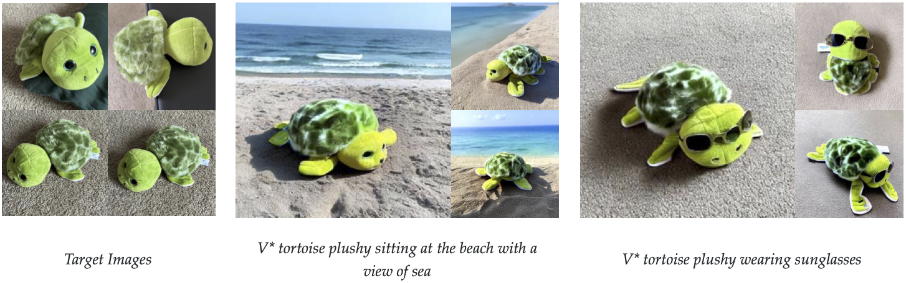
</p>
<p align="center">
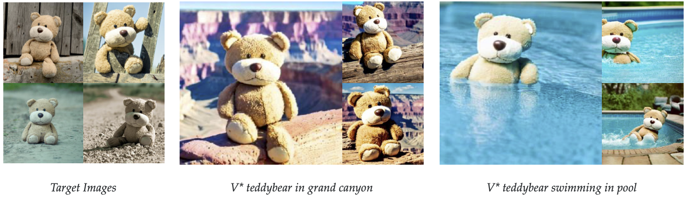
</p>
<p align="center">
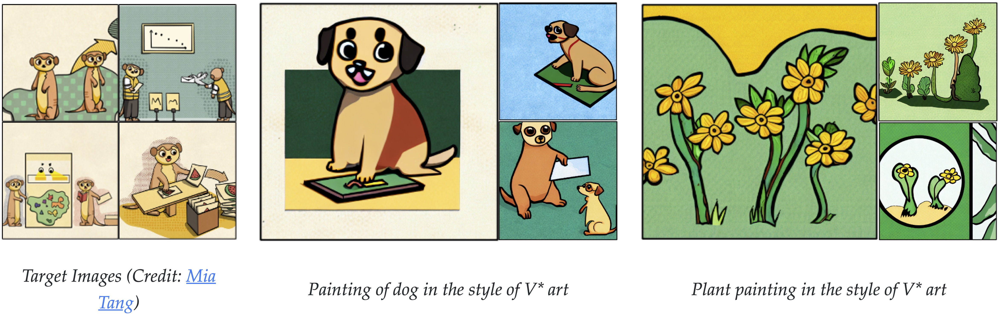
</p>
<p align="center">
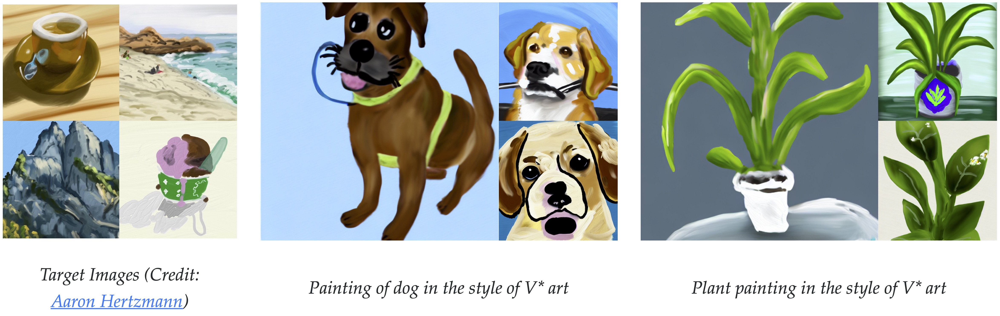
</p>
<p align="center">
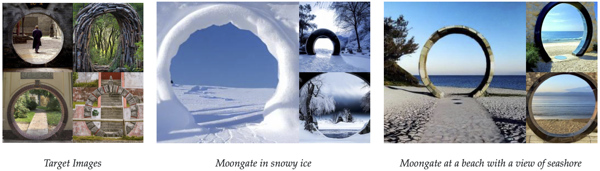
</p>
<p align="center">
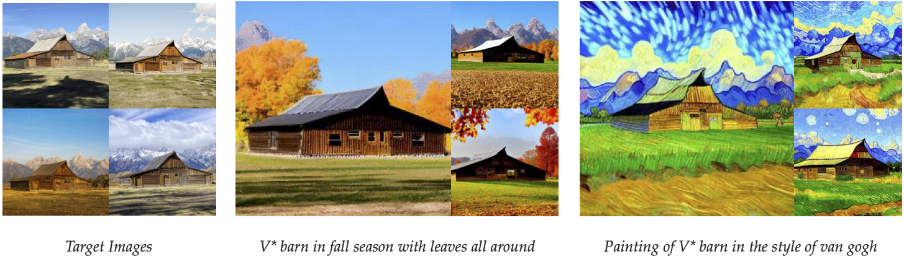
</p>
<p align="center">
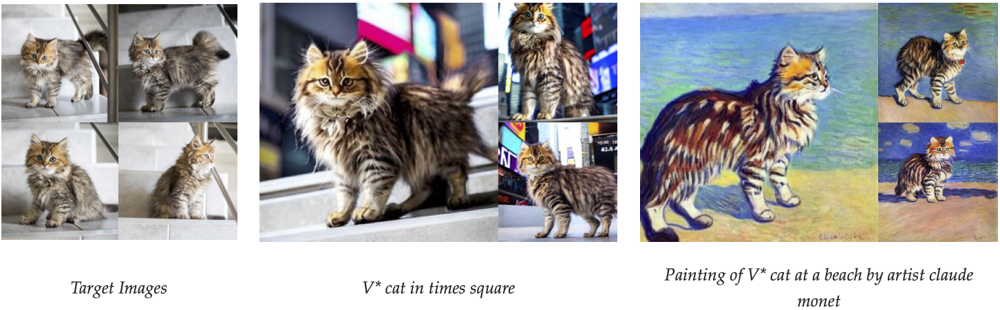
</p>
<p align="center">
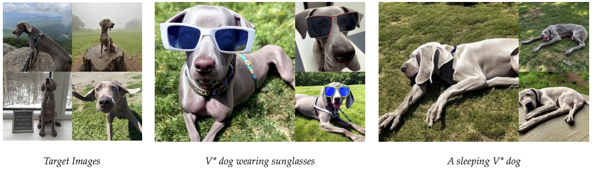
</p>
</div>


### Multi-Concept Results


<div>
<p align="center">
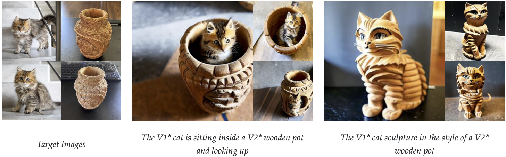
</p>
<p align="center">
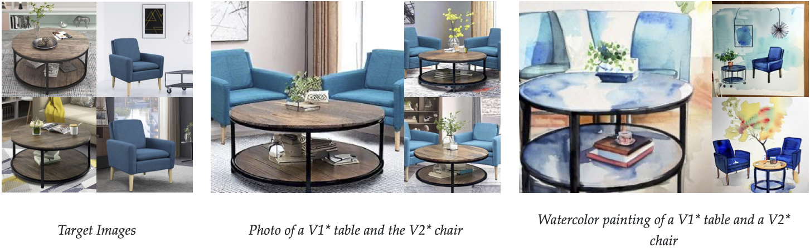
</p>
<p align="center">
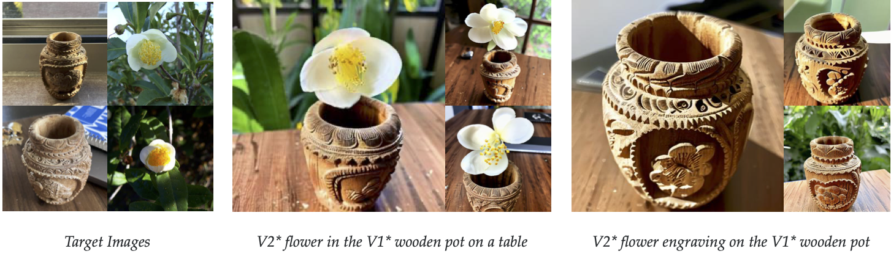
</p>
<p align="center">
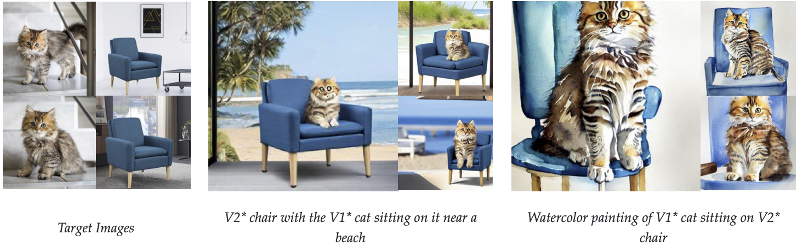
</p>
</div>


## Method Details


<div>
<p align="center">
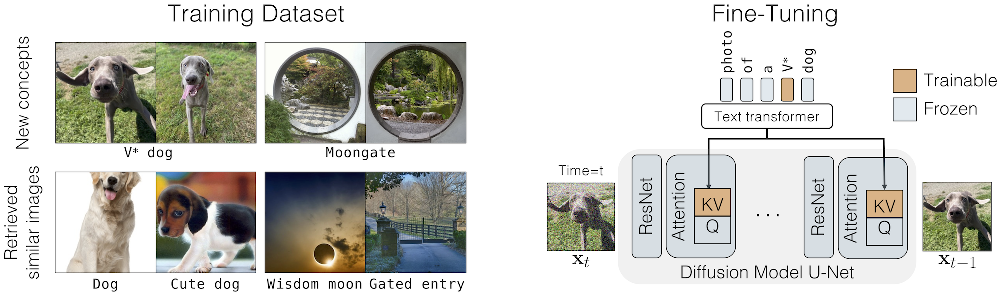
</p>
</div>


Given the few user-provided images of a concept, our method augments a pre-trained text-to-image diffusion model, enabling new generations of the concept in unseen contexts. 
We fine-tune a small subset of model weights, namely the key and value mapping from text to latent features in the cross-attention layers of the diffusion model. 
Our method also uses a small set of regularization images (200) to prevent overfitting. For personal categories we add a new modifier token V* in front of the category name e.g., V* dog.
For multiple-concepts we jointly train on the dataset for the two concepts. Our method also enables post-hoc merging of two fine-tuned models using optimization. 
For more details please refer to our paper.  


## References

```
@article{kumari2022customdiffusion,
  title={Multi-Concept Customization of Text-to-Image Diffusion},
  author={Kumari, Nupur and Zhang, Bingliang and Zhang, Richard and Shechtman, Eli and Zhu, Jun-Yan},
  journal = {arXiv},
  year = {2022}
}
```

## Acknowledgments
We are grateful to Nick Kolkin, David Bau, Sheng-Yu Wang, Gaurav Parmar, John Nack, and Sylvain Paris for their helpful comments and discussion, and to Allie Chang, Chen Wu, Sumith Kulal, Minguk Kang, Yotam Nitzan, and Taesung Park for proofreading the draft. We also thank Mia Tang and Aaron Hertzmann for sharing their artwork. Some of the datasets are downloaded from Unsplash. This work was partly done by Nupur Kumari during the Adobe internship. The work is partly supported by Adobe Inc. 